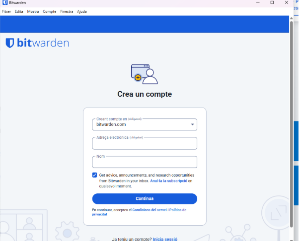
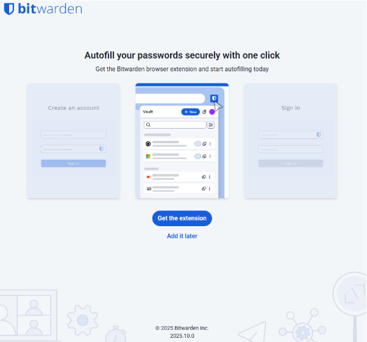
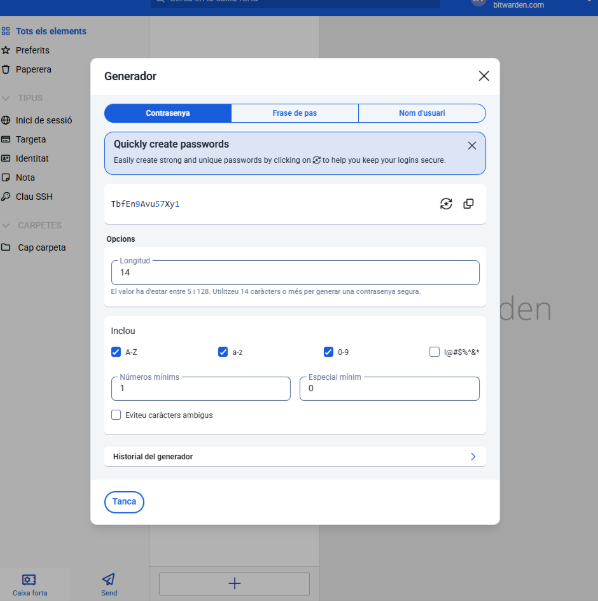

# 🧩 Fase 1: Anàlisi i Justificació  
## Informe Tècnic: Implementació d’un Gestor de Contrasenyes a EverPia

---

### 🔹 Introducció i Justificació

Recentment, **EverPia** ha patit una **fuita d’informació (data breach)** derivada de la compromissió d’un compte tècnic a causa de l’ús d’una **contrasenya feble o reutilitzada**.

Les contrasenyes febles o reutilitzades representen un **risc crític per a la seguretat corporativa** per diverses raons:

- **Atacs de diccionari i força bruta**
- **Credential stuffing** (reutilització de credencials robades)
- **Phishing i enginyeria social**

---

### 🔐 Funció d’un Gestor de Contrasenyes

Un **gestor de contrasenyes** permet **generar, emmagatzemar i gestionar credencials** de manera **segura, xifrada i centralitzada**.

Els beneficis principals d’implantar un gestor de contrasenyes són:

- **Generació automàtica** de contrasenyes robustes i úniques.  
- **Xifratge end-to-end** de totes les dades sensibles.  
- **Autenticació simplificada** i reducció del risc de reutilització de credencials.  
- **Sincronització controlada** entre dispositius de treball.  

Implementar un gestor de contrasenyes per a tot el personal tècnic **redueix dràsticament la superfície d’atac** relacionada amb les credencials.

---

## ⚙️ Comparativa Tècnica

| **Característica** | **Bitwarden (Online)** | **KeePassXC (Offline)** |
|--------------------|------------------------|--------------------------|
| **Mode d’ús** | Aplicació al núvol amb sincronització | Aplicació local d’escriptori |
| **Xifratge** | End-to-end amb AES-256 abans de pujar al núvol | Xifratge local AES-256 dins del fitxer `.kdbx` |
| **Sincronització** | Sí, automàtica entre dispositius | No nativa (manual amb serveis externs) |
| **Accés multi-dispositiu** | Sí, via web, mòbil i extensions de navegador | Només dispositius amb accés al fitxer |
| **Autenticació 2FA** | Sí (OTP, U2F, etc.) | No integrada per defecte |
| **Codi obert** | Sí | Sí |
| **Dependència del núvol** | Sí, però amb xifrat previ | No (fitxer local, pot ser encriptat externament) |
| **Portabilitat** | Alta (accedir-hi des de qualsevol lloc) | Alta (es pot copiar el fitxer `.kdbx` a una memòria USB) |
| **Facilitat d’ús** | Molt alta (interfície moderna i intuïtiva) | Mitjana (interfície més tècnica) |
| **Cost** | Model freemium (funcions essencials gratuïtes) | Gratuït |
| **Gestió d’equip** | Sí (organitzacions, usuaris, rols) | No nativa (sense gestió centralitzada) |

---

## ⚖️ Avantatges i Inconvenients

### 🟩 Bitwarden (Model Online / Núvol)

**Avantatges:**
- Sincronització automàtica i còmoda entre dispositius.  
- Gestió centralitzada d’equips i compartició segura.  
- Autenticació multifactor (2FA) integrada.  
- Codi obert i transparent.  
- Interfície moderna i intuïtiva, ideal per a equips amb perfils diversos.

**Inconvenients:**
- Dependència d’un servidor extern (tot i el xifrat previ).  
- Necessita connexió a Internet per sincronitzar.

---

### 🟦 KeePassXC (Model Offline / Local)

**Avantatges:**
- Control total sobre el fitxer de credencials.  
- No depèn de tercers ni del núvol.  
- Ideal per a entorns molt restringits o aïllats.  
- Codi obert i auditable.

**Inconvenients:**
- No té sincronització automàtica.  
- Compartir credencials entre equips és més complex.  
- Manca de gestió centralitzada d’equips.  
- Pot resultar menys intuïtiu per a usuaris no tècnics.

---

## ✅ Recomanació Final

Després d’analitzar les opcions disponibles, **recomanem implementar Bitwarden** com a gestor de contrasenyes per al personal tècnic d’EverPia.

### Motius principals:

- **Seguretat:**  
  Bitwarden empra **xifratge end-to-end**, garantint que les dades només siguin accessibles per l’usuari.

- **Facilitat de desplegament i ús:**  
  Permet un **onboarding ràpid** i és molt intuïtiu.

- **Gestió centralitzada:**  
  Possibilita **administrar usuaris, rols i compartició de credencials** de forma controlada.

- **Adaptabilitat:**  
  Es pot utilitzar en **diferents dispositius, escenaris i plataformes.**

- **Codi obert i transparent:**  
  Es pot **auditar el seu funcionament** i no depèn de programari propietari tancat.

- **Continuïtat de negoci:**  
  En cas de canvi d’ordinador o pèrdua de dispositiu, l’usuari pot **recuperar l’accés fàcilment** des de qualsevol terminal autoritzat.

---

## 🏁 Conclusió

La implantació de **Bitwarden** a EverPia permetrà:

- Millorar la **seguretat corporativa**.  
- Reduir el risc associat a **credencials febles o reutilitzades**.  
- Estandarditzar la **gestió d’identitats i contrasenyes** dins l’organització.  
- Promoure una cultura de **bones pràctiques en ciberseguretat** dins del personal tècnic.

---

📄 *Informe elaborat per:* **[Nom de l’estudiant]**  
📅 *Data:* **28/10/2025**  
🏢 *Empresa:* **EverPia**

# 🧭 Fase 2: Guia d’Ús Tècnica (Manual Operatiu)
## Implementació i Ús de Bitwarden per al Personal Tècnic d’EverPia

---

### 🔹 1. Objectiu del Manual
Aquest document té com a objectiu **guiar el personal tècnic d’EverPia** en la instal·lació, configuració i ús segur del **gestor de contrasenyes Bitwarden**, segons la política interna de seguretat aprovada després de la fuita d’informació.

L’objectiu és assegurar que:
- Totes les credencials siguin **robustes, úniques i xifrades**.
- Es garanteixi una **gestió centralitzada i segura** de les contrasenyes corporatives.
- El procés d’ús sigui **senzill i homogeni** entre tot el personal tècnic.

---

# 🧭 Fase 2: Guia d'Ús Tècnica (Manual Operatiu)

## Instal·lació Bitwarden

En primer lloc, obre el navegador i accedeix al **buscador Google**.  
A la barra de cerca, escriu:

Un cop descarregat, he creat un compte nou i li he posat un correu i una contrasenya per poder accedir.

