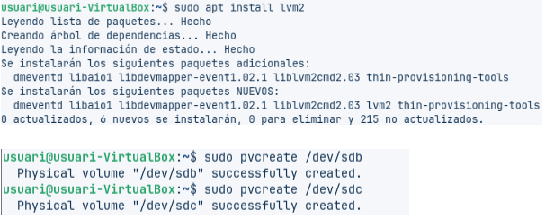
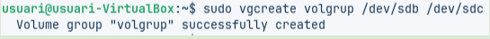
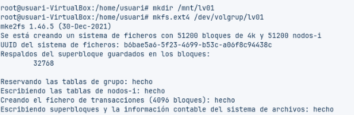
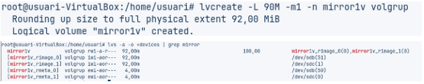

# 🐧 Part Linux: LVM amb Zorin OS

Un cop superada la fase de formació, ja esteu preparats per afrontar el repte dels nostres clients.  

Com ja es va explicar, tenim un nou i important client: el bufet d’advocats **Garriga i Associats**, un dels més prestigiosos de la ciutat. Aquest client gestiona una gran quantitat d'informació legal sensible, per la qual cosa la **integritat**, la **disponibilitat** (alta redundància) i la **facilitat de gestió** del seu emmagatzematge són d'importància crítica. ⚖️💾  


La direcció de *Garriga i Associats* ha expressat la necessitat urgent de **renovar els seus sistemes de servidors** per garantir que la informació estigui protegida contra fallades de disc i que l'espai pugui ser ampliat sense interrupcions.

Com a tècnics d’**Everpia**, teniu l'encàrrec de **dissenyar i documentar** les solucions d'emmagatzematge que compliran aquests requisits tant en entorns **Linux** com **Windows**.  
Aquest disseny permetrà presentar al client una proposta de solució sòlida i escalable.

---

## 🎯 Objectiu Principal

Dissenyar i documentar **dues solucions d'emmagatzematge** (una per servidors **Linux** i una per **Windows**) que compleixin amb els principis següents:

- 🔁 Alta disponibilitat  
- 🧩 Redundància  
- 📈 Escalabilitat  

> 🧠 Com que és una prova de concepte, no es treballarà amb servidors físics, sinó amb **màquines virtuals** de sistemes operatius clients per documentar els procediments.

---

## 🐧 1. Part Linux: LVM amb Zorin OS

S'ha d'utilitzar la distribució **Zorin OS** (o una alternativa Linux compatible) per demostrar la utilitat del **Logical Volume Manager (LVM)**.

### ⚙️ Requisits de la Implementació i Demostració

#### 🧱 Configuració Inicial
- Crear un **grup de volums (VG)** i un **volum lògic (LV)** utilitzant **dos discs durs simulats** de **10 GB** cadascun.  
- El volum ha d’estar **formatat i muntat automàticament** al sistema mitjançant l’edició de l’arxiu `/etc/fstab`.

#### 🔒 Alta Disponibilitat
- Implementar una configuració amb **mirall (lvm_mirror)** per protegir la informació davant la fallada d’un disc.

#### 🪞 Instantànies (Snapshots)
- Afegir **dos discos de 10 GB** addicionals al grup de volums.  
- Crear un volum `lvm_dades` amb el **primer disc afegit**, formatar-lo i muntar-lo.  
- Afegir-hi **arxius (per exemple, imatges d’Internet)**.  
- Utilitzar el **segon disc** per crear un **snapshot (`lv_snapshot`)** i documentar com **restaurar-lo** en cas que la informació original es danyi.

#### 📈 Escalabilitat
- Demostrar el procés d’**ampliació del volum `lv_dades`** utilitzant l’espai lliure restant dins el grup de volums.

---

## 🧰 Configuració Inicial

Com a **configuració inicial**, i amb la màquina **aturada**, s’han creat **dos discs virtuals de 10 GB cadascun**.  
Això permet disposar d’un **emmagatzematge més elevat** per realitzar totes les proves i configuracions necessàries. 💽💡


---

## 💽 Verificació dels Discs Virtuals

Acte seguit, hem obert la **màquina virtual** i hem comprovat, amb la següent comanda, que el sistema hagi detectat els dos discos creats anteriorment:

```bash
fdisk -l

```

Vols que continuï amb el següent pas (per exemple, la creació de particions amb `pvcreate`, `vgcreate`, etc.) en el mateix estil Markdown? Puc seguir el fil i fer-te tota la documentació pas a pas.


---

## ⚙️ 1. Configuració inicial d’un grup de volums (VG) i un volum lògic (LV)

Per començar, hem creat els **volums físics** amb la comanda següent:

```bash
sudo pvcreate

sudo apt install lvm2


Vols que continuï amb el següent pas — la creació del **Volume Group (VG)** i el **Logical Volume (LV)** amb les seves comandes (`vgcreate`, `lvcreate`, etc.) en el mateix estil Markdown?

```


---

Ara crearem un **grup de volums (VG)** i els **assignarem als dos discs** amb la comanda `vgcreate`.



---

Posteriorment, podem **crear o eliminar volums** segons sigui necessari.  

### ➕ Afegir volums
Per afegir un nou disc a un grup de volums existent, utilitzem la comanda:

```bash
vgextend [nom_del_vg] [disc]

```

vgextend volgrup /dev/sdd

vgdisplay


---

Per crear un **volum lògic (LV)**, hem d’indicar la **mida**, el **grup de volums (VG)** i el **nom** que volem assignar-li.  

La sintaxi és la següent:

```bash
lvcreate -L [Mida] -n [Nom_del_Volum_Lògic] [Nom_del_Grup]

```
lvcreate -L 200M -n lv01 volgrup


---

Cada **volum lògic (LV)** és com una **partició del disc**, per tant cal **muntar-lo correctament** perquè sigui funcional dins del sistema.  

Per fer-ho, primer hem de **crear una carpeta** on muntarem el volum dins el sistema d’arxius de la màquina.  

### 🗂️ Crear la carpeta de muntatge
```bash
mkdir /mnt/lv01

```
mkfs.ext4 /dev/volgrup/lv01
mount /dev/volgrup/lv01 /mnt/lv01



---

Ara ja tindríem el volum **inicialitzat**, però per poder **utilitzar-lo**, cal **muntar-lo** a la carpeta que hem creat prèviament.  

### ⚙️ Muntar el volum manualment
```bash
mount /dev/volgrup/lv01 /mnt/lv01/

```

nano /etc/fstab


---

## 📘 Significat dels camps a /etc/fstab

Els camps de la línia que hem utilitzat tenen el següent significat:

- `/dev/volgrup/lv01`: unitat que es vol muntar.  
- `/mnt/lv01`: punt de muntatge.  
- `ext4`: per indicar el sistema de fitxers utilitzat.  
- `defaults`: opcions de muntatge per defecte (es podria indicar si és només lectura, etc.).  
- `dump`: `0` per indicar que el sistema de fitxers **no s’ha de bolcar** (configuració normal actualment).  
- `pass`: `0` per indicar que **no es faran comprovacions** d’aquest volum en arrencar el sistema.  

---

## 📏 Modificar la mida d’un volum lògic (LV)

Si volem **modificar el tamany** d’un volum lògic, utilitzarem normalment aquestes comandes:

- `lvextend`: només serveix per **estendre** el volum.  
- `lvreduce`: permet **reduir** la mida.  
- També podem usar la comanda `lvresize`.

> ⚠️ **IMPORTANT:** Sempre que vulguem modificar un LV, **haurem de desmuntar-lo** perquè **no estigui en ús**.

---

## 🪞 2. Creació d’un mirall (lvm_mirror)

Per crear un **mirall simple** del nostre volum lògic, haurem de fer servir la comanda següent:

```bash
lvcreate -L 90M -m1 -n mirror1v volgrup

```



---

El **sistema de mirall** ja estaria **creat correctament**. 🪞✅  

---

## 📸 3. Creació d’un snapshot del nostre volum lògic

Ara crearem un **snapshot** (còpia temporal) del nostre **volum lògic (LV)**.  
Abans de fer-ho, crearem alguns **arxius de prova** dins el volum per poder comprovar el funcionament.  

Per crear-los, utilitzarem la comanda `touch`:

```bash
touch /mnt/lv01/file01
touch /mnt/lv01/file02
touch /mnt/lv01/file03

```
El **sistema de mirall** ja estaria **creat correctament**. 🪞✅  

---

## 📸 3. Creació d’un snapshot del nostre volum lògic

Ara crearem un **snapshot** (còpia temporal) del nostre **volum lògic (LV)**.  
Abans de fer-ho, crearem alguns **arxius de prova** dins el volum per poder comprovar el funcionament.  

Per crear-los, utilitzarem la comanda `touch`:

```bash
touch /mnt/lv01/file01
touch /mnt/lv01/file02
touch /mnt/lv01/file03


```


---

Seguidament, crearem la **instantània (snapshot)** del nostre volum lògic amb la comanda `lvcreate`.  

Aquesta instantània ens permetrà **restaurar l’estat anterior** del volum en cas que es modifiqui o s’esborri informació.  

```bash
lvcreate -L 100M -s -n copialv01 /dev/volgrup/lv01

```


---

En aquesta comanda utilitzem l’opció `-s` per indicar que es tracta d’un **snapshot**. 📸  

Per **veure tots els volums lògics (LV)** que tenim creats i comprovar com la **còpia (snapshot)** apunta a l’**original**, farem servir la comanda següent:

```bash
lvs volgrup

```

