 **Aquí podràs trobar la tasca 04 i la seva correcció.** ✅

# 🧩 **T04: Serveis de Directori - LDAP**

📂 En aquesta tasca treballarem amb **serveis de directori LDAP**, aprenent a **instal·lar, configurar i validar** un servidor OpenLDAP i la seva integració amb un client Ubuntu.

🚀 Objectiu: comprendre com funciona LDAP com a **directori centralitzat d’usuaris i grups**, i posar-lo en pràctica en un entorn virtual de proves.

🧠 Temes clau:
- Instal·lació i configuració bàsica d’OpenLDAP  
- Creació d’Unitats Organitzatives (OUs), usuaris i grups  
- Gestió amb **LDAP Account Manager (LAM)**  
- Integració d’un client Ubuntu amb autenticació LDAP  

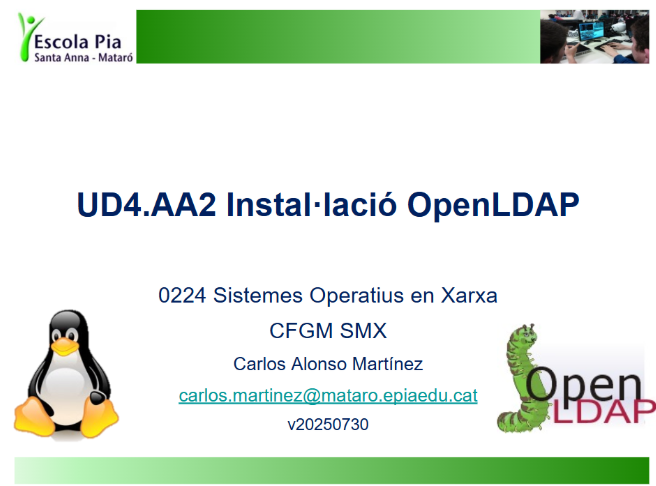

---

# 📝 Sobre aquesta guia

En aquesta guia veurem el **procés complet** per instal·lar, configurar i provar un servei de directori basat en **OpenLDAP** en un entorn **GNU/Linux**.


En primer lloc, he creat una màquina nova i li he posat el nom de:  
**T04: Serveis de directori - LDAP** 🖥️  

He utilitzat la **ISO de Ubuntu**, i acte seguit he iniciat la màquina i he establert la contrasenya:  


Un cop fet això, he reiniciat la màquina i he començat a seguir els passos per dur a terme l’activitat **T04**.

Per canviar el nom del servidor de `server` a `server.innovatech25.test`, he fet:  

```bash
sudo nano /etc/hosts
````
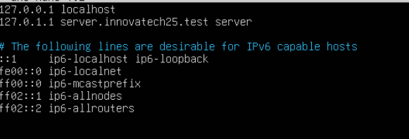  

---

Després de canviar el nom del servidor, he **aturat la màquina** per entrar a l’apartat de **Paràmetres** i he configurat els adaptadors de xarxa 🌐.

- **Primer adaptador:** NAT (per accés a Internet i descàrrega de paquets)  
- **Segon adaptador:** Host-Only / Amfitrió (per a comunicació privada amb la màquina física)

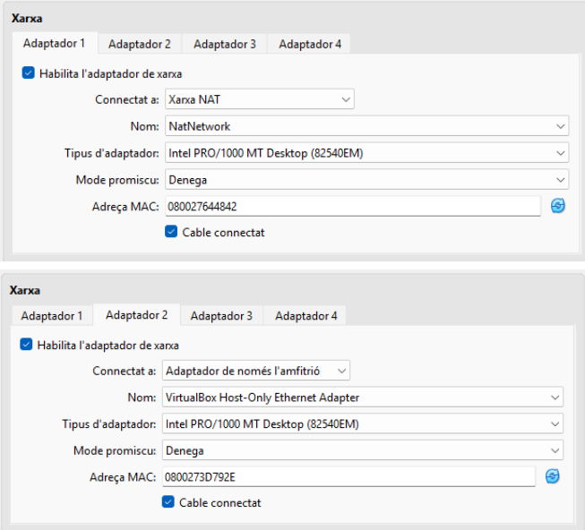

---

# 🛠️ Instal·lació OpenLDAP

Per instal·lar el servei **slapd** i les utilitats **ldap-utils**, he executat la següent comanda:

```bash
sudo apt install slapd ldap-utils -y

```
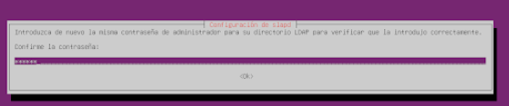

# ✅ Comprovació del servei OpenLDAP

Per verificar que el servei **OpenLDAP (slapd)** està funcionant correctament, he executat:

```bash
systemctl status slapd

```
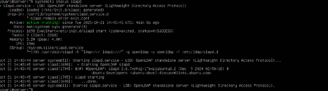

En cas de que haguem posat un nom que no era el correcte, es pot rectificar fent un:

```bash
sudo dpkg-reconfigure slapd
```
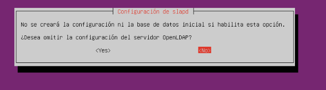

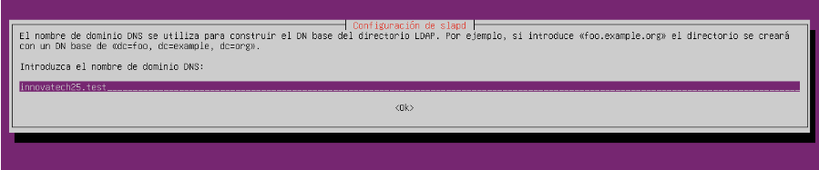

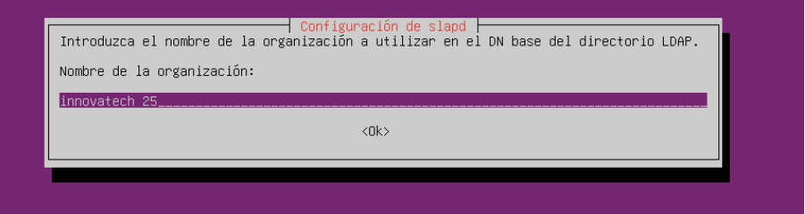

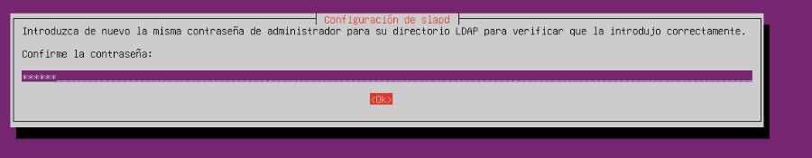

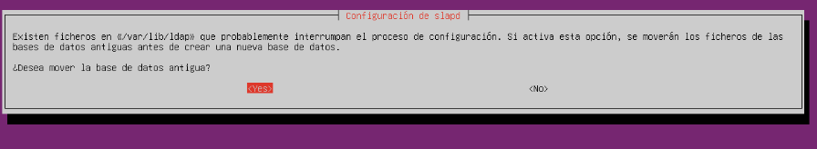

Per fer la comprovació que el que hem modificat estigui bé, he fet un:

```bash
sudo slapcat

```
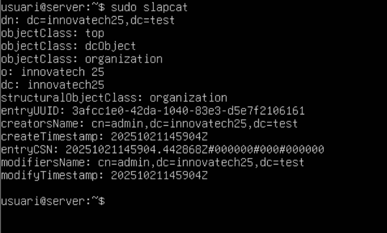

Algunes eines que ens ofereix **slapcat** són:

1️⃣ **ldapadd**: permet afegir elements al directori.  
2️⃣ **ldapsearch**: serveix per fer consultes i cercar dins del directori.  
3️⃣ **ldapdelete**: permet eliminar objectes, inclòs el propi directori.  
4️⃣ **ldappasswd**: s’utilitza per canviar la contrasenya d’un usuari.  
5️⃣ **ldapmodify**: serveix per editar una entrada ja existent.

He creat un fitxer `OU_users.ldif` amb la informació de la nova unitat **“Usuaris”**.

Després, amb el codi:

```bash
ldapadd -D "cn=admin,dc=innovatech25,dc=test" -W -f OU_users.ldif

```


---

# COMPTE DE LDAP

En primer lloc, he accedit a **LDAP Account Manager** per poder manipular des de dins.

En els menús, he anat a la part de **Edit Server Profiles** i he editat les dades del meu servidor posant el que em demana la guia:

- **Nom:** lam  
- **Contrasenya:** ***


---

Un cop a dins, he posat l'adreça corresponent per no tenir cap error quan confirmi els canvis.


---


---


---

He canviat l'idioma a **espanyol**.


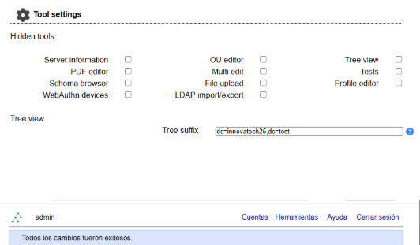

---

I un cop acabats tots els canvis, he pogut veure que si fas un error des de dins, això et perjudica a l'hora de desar-los.

---

# FASE 2 (CLIENT) 🚀

En primer lloc, he fet **ping** utilitzant el codi:

```bash
ping server.innovatech25.test

```


---

Acte seguit, he fet:

```bash
hostname -f

```

hostnamectl set-hostname client.innovatech25.test

hostname -f


---

A continuació, he instal·lat els mòduls necessaris per poder usar **libpam** i **nss** utilitzant el codi:

```bash
sudo apt install libnss-ldap libpam-ldap-utils nscd -y

```

⚠️ **IMPORTANT:** Hem de canviar el nom de **ldapi** per **ldap** i treure una de les 3 `///`.


---

Un cop donat a **Acceptar**, he canviat les credencials per **innovatech25** i després he posat **test**.


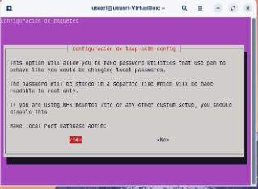

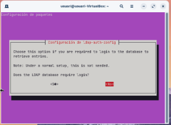

---

Un altre cop, he tornat a manipular les credencials i posar **admin.innovatech25** i **test**.


---

Acte seguit, he tornat a posar la contrasenya que vaig posar a **LDAP**, en aquest cas:

- **Contrasenya:** p@ssw0rd

Un cop això, ja m’ha carregat, i això significa que ja he canviat les credencials i no he tingut cap error.

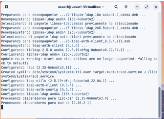

---

Ara faré una consulta amb **LDAP** des del client per veure si connecta amb el servidor.  
El codi que he utilitzat és el següent:

```bash
ldapsearch -X -D 'cn=admin,dc=innovatech25,dc=test' -W -H ldap://server.innovatech25.test -b 'dc=innovatech25,dc=test' objectClass=posixAccount uid

```


---

Acte seguit, he configurat l'arxiu **nsswitch.conf**.  
Per entrar i modificar els canvis, he utilitzat el codi:

```bash
sudo nano /etc/nsswitch.conf

```


---

He editat l'arxiu:

```bash
sudo nano /etc/pam.d/common-password

```

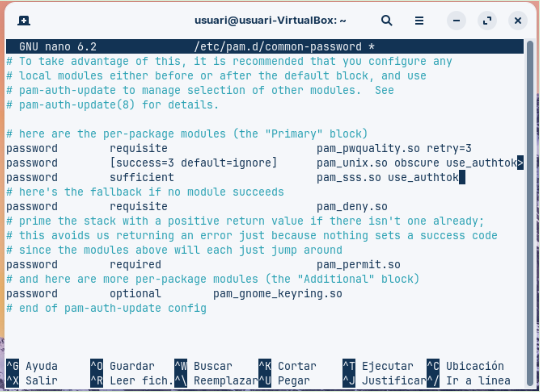

---

Acte seguit, he editat l'arxiu:

```bash
sudo nano /etc/pam.d/common-password

```

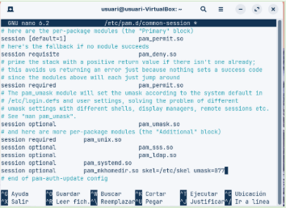

---

En primer lloc, m’he posat **en root** utilitzant el codi:

```bash
sudo su

```

systemctl restart nscd
getent passwd | tail

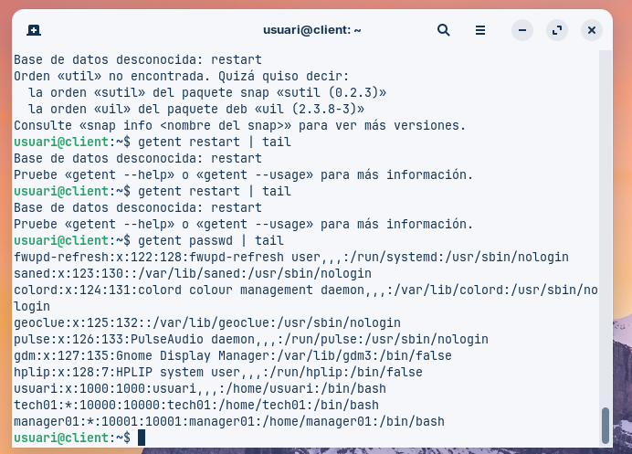

---

I per finalitzar, he editat l'arxiu indicat per permetre l’inici de sessió gràfica, utilitzant el codi:

```bash
sudo nano /etc/pam.d/gdm-launch-environment

```
