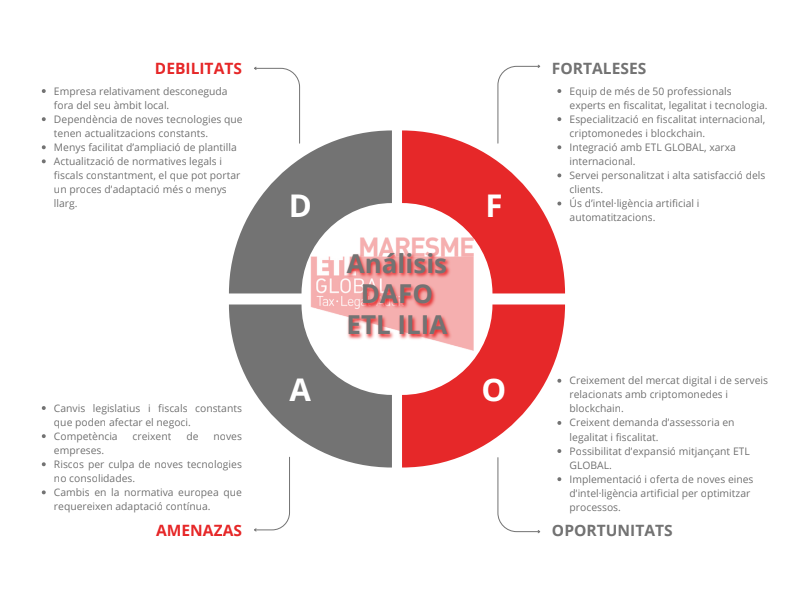

# 🌍 Anàlisi de l’entorn real de l’empresa

---

# 📑 Taula de continguts

1. 🏢 **Organigrama de l’empresa** ............................................................. 3
2. 🌍 **Analitzar l’entorn real de l’empresa** – Microentorn i Macroentorn ............. 3
    2.1 🔹 **Microentorn** .................................................................................. 3
    2.2 🔸 **Macroentorn** ............................................................................... 4
3. 🔄 **Definir els canvis de l’entorn de l’empresa** ........................................... 5
4. ⚙️ **Del món VUCA al món BANI** .......................................................... 5
5. 💼 **CANVAS del model de negoci del client** (com crea, capta i ofereix valor) ... 5
6. 🧱 **Descripció de la tipologia i patró del negoci** ...................................... 6
7. 🤖 **Aplicar la intel·ligència artificial al disseny del model de negoci** ............ 6

---

# 🏢 Organigrama de l’empresa

---

# 🌍 2. Analitzar l’entorn real de l’empresa

## 🔹 2.1 Microentorn

El **microentorn** correspon a tots els actors i elements directament relacionats amb l’activitat diària de l’empresa i que influeixen de manera immediata en la seva gestió.

* 👥 **Clients:** Principalment PYMEs, autònoms i start-ups del Maresme i Barcelona (també Mallorca com a “sub-empresa”), amb necessitat de serveis fiscals, jurídics, laborals i comptables.
* 🤝 **Proveïdors i partners:** Software comptable, plataformes de gestió digital, serveis tecnològics per a automatització i subcontractistes en auditoria o legal. *ETL GLOBAL* actua com a suport internacional.
* ⚖️ **Competència:** Despatxos locals i regionals de consultoria fiscal, legal i laboral. Alta competència en preu i especialització.
* 🌐 **Intermediaris i aliances:** Col·laboracions amb coworkings, universitats i entitats locals (ex. TecnoCampus Mataró), que faciliten l’accés a start-ups i empreses tecnològiques. També formen part d’una aliança de despatxos.
* 👔 **Propietat i equip intern:** Professionals multidisciplinaris amb experiència en fiscalitat, dret mercantil, comptabilitat i digitalització. Direcció i oficina principal a Barcelona, amb oficina local a Mataró.

📈 **Conclusió microentorn:**
L’empresa es troba en un teixit empresarial actiu i competitiu, on la proximitat amb el client i l’especialització en tecnologia i internacionalització són factors clau per diferenciar-se i captar clients.

---

## 🌎 2.2 Macroentorn

El **macroentorn** inclou els factors externs generals que afecten el sector i l’activitat de l’empresa, però sobre els quals *ETL ILIA* té poc control directe.

* 💶 **Entorn econòmic:** Recuperació moderada del teixit empresarial català després de la crisi sanitària, amb creixement de l’activitat emprenedora. La inflació i la inestabilitat econòmica poden reduir la demanda de serveis de consultoria.
* 💻 **Entorn tecnològic:** Transformació digital constant, amb digitalització de processos comptables i ús de programari com *ERPLoop*, *Biloop* o *A3ASSESOR*.
* ⚖️ **Entorn legal i regulatori:** Canvis continus en la legislació fiscal, laboral i mercantil, amb necessitat de complir regulacions sobre protecció de dades, tributació digital i criptomonedes.
* 👨‍💼 **Entorn sociocultural:** Creixement d’empreses tecnològiques que busquen serveis professionals més innovadors, digitals i de qualitat.
* 🏛️ **Entorn polític:** Estabilitat relativa a Catalunya i Espanya, amb polítiques que fomenten l’emprenedoria, la internacionalització i la digitalització, però regulacions estrictes en fiscalitat i laboral.
* 🌱 **Entorn ambiental:** Menor impacte directe, però creixent demanda de responsabilitat social i sostenibilitat empresarial.

📊 **Conclusió macroentorn:**
*ETL ILIA* es mou en un entorn favorable per a serveis d’alta especialització, però ha de mantenir-se actualitzada en tecnologia, regulacions i tendències per seguir sent competitiva.

---

## 💼 6. Descripció de la tipologia i patró del negoci

**ETL ILIA** és un **despatx professional** especialitzat en serveis de **consultoria fiscal, legal i laboral**.
El seu model de negoci combina dues línies principals:

* 🏢 **B2B** (serveis per a empreses)
* 👤 **B2C** (serveis per a particulars)

L’empresa aposta per la **confiança, la proximitat i la tecnologia** com a pilars fonamentals.
Manté relacions duradores amb els clients i utilitza eines digitals i **intel·ligència artificial** per millorar l’eficiència, reduir errors i oferir un servei àgil i personalitzat.

📈 **En resum:**
Un negoci orientat a la qualitat, la innovació i la digitalització dins d’un entorn professional competitiu.

---

## 🤖 7. Aplicar la intel·ligència artificial al disseny del model de negoci

A **ETL ILIA**, la **intel·ligència artificial (IA)** s’utilitza per potenciar i optimitzar els processos interns i externs:

* 🧾 **Gestió documental:** automatització d’arxius i classificació intel·ligent.
* 💰 **Informes fiscals:** generació automàtica i reducció d’errors humans.
* ⚖️ **Anàlisi de riscos legals:** detecció preventiva de possibles incidències.
* 📅 **Gestió de cites i clients:** automatització i millora de l’atenció personalitzada.

La IA garanteix **eficiència, seguretat i compliment legal** amb la nova normativa europea.
Com a estudiant en pràctiques, participo en aquest procés d’integració tecnològica, **creant GPTs personalitzats** i dissenyant **prompts eficaços** per optimitzar el treball diari del despatx.

---

## 📊 8. DAFO per comprovar la viabilitat potencial del client

*(Secció següent)*

---

# 🚀 Estratègia de futur per ETL ILIA

L’empresa **ETL ILIA** té com a objectiu continuar creixent i adaptant-se a un entorn cada cop més digital i competitiu. A continuació es detallen les seves principals línies d’estratègia de futur:

---

### 🌐 1. Fer conèixer més l’empresa

Aprofitar la **xarxa internacional ETL GLOBAL** per arribar a nous mercats i **augmentar la visibilitat**.
Potenciar la presència digital i la comunicació amb clients d’arreu del territori.

---

### 🤖 2. Aprendre i utilitzar noves tecnologies

Continuar **implementant automatitzacions** i **intel·ligència artificial** per optimitzar processos i millorar la productivitat.
L’objectiu és oferir un servei més **ràpid, precís i adaptat** a les necessitats dels clients.

---

### 🎓 3. Formació contínua

Promoure que tot l’equip mantingui una **formació constant** en legislació, eines digitals i noves tecnologies.
Això garanteix una **actualització permanent** davant els canvis normatius i tecnològics.

---

### 💼 4. Oferir més serveis

Ampliar el catàleg de serveis, especialment en àrees emergents com:

* 💰 **Gestió de criptomonedes**
* 🔐 **Seguretat digital i protecció de dades**

Això permetrà donar un servei **integral i modern** als clients.

---

### 💬 5. Millorar la comunicació

Enfortir la comunicació amb els clients, explicant millor **què fa l’empresa** i **com pot ajudar-los**.
Potenciar canals digitals i xarxes socials per transmetre **valors i transparència**.

---

### 👥 6. Gestionar bé l’equip

Fer créixer l’equip de manera **intel·ligent i sostenible**, contractant només quan sigui necessari i buscant perfils altament qualificats.
L’objectiu és **mantenir la qualitat del servei** mentre es dóna resposta a un volum més gran de clients.

---

💡 **Conclusió:**
Amb aquesta estratègia, ETL ILIA es posiciona com un **referent en consultoria digital i legal**, combinant experiència, innovació i proximitat amb el client.

