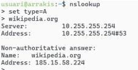

# 🧩 T06: Fonaments del servei DNS

## 📄 Breu descripció

Com a membres cada cop més integrats de l’equip tècnic de la consultora **EverPia**, teniu davant un nou repte.
El vostre client, una empresa de màrqueting digital (**DigiCore**), experimenta de tant en tant errors de connectivitat en certes aplicacions.
El seu equip tècnic sospita que la causa principal podria ser una **resolució de noms (DNS)** incorrecta o lenta.

Se us ha encarregat **realitzar una auditoria teòrica i pràctica del servei DNS** per tal de formar el personal del client i oferir eines de diagnosi ràpides.


---

## 🧠 Fase teòrica: Sessió formativa

Com a part d’aquesta formació, caldrà que elaboreu **material formatiu** pel personal del client.
Per assegurar la màxima qualitat, els vostres directors tècnics han preparat unes sessions prèvies per tal que domineu els conceptes que després haureu d’explicar.

### 📚 Conceptes a tractar

* **Jerarquia i Estructura**
  Explicació de l’estructura en arbre del DNS: `Root > TLDs > Segon Nivell`.

* **Procés de Resolució**
  Com es realitza una consulta **iterativa** i una **recursiva**.
  Què és un **servidor d’arrel (Root Server)** i un **servidor autoritatiu**.

* **Tipus de zones**

  * Directa i inversa
  * Zona primària i zona secundària

* **Tipus de Registres Clau (Records)**
  Funció dels registres **A**, **CNAME**, **MX**, **NS** i **SVR**.

* **Conceptes essencials**

  * **Resposta Autoritativa**: què significa i com identificar-la
  * **Time To Live (TTL)**: funció i impacte en propagació i rendiment
  * **Start of Authority (SOA)**: informació essencial i importància
  * **Reenviadors**: condicionals i incondicionals
  * **Resolució local**: mecanismes sense servidor entre equips clients (protocol **mDNS**)

### 🎬 Activitat de la fase teòrica

Un cop domineu aquests conceptes, haureu de preparar una **píndola formativa en vídeo** (entre **10 i 15 minuts**) que expliqui de forma breu però clara tots aquests conceptes.

---

## 🧰 Fase pràctica: Diagnosi de Noms (Auditoria amb CLI)

Heu de demostrar l’ús de les principals **utilitats de diagnosi DNS** en els diferents sistemes operatius del client (**Linux/macOS i Windows**).

Per a cada eina, **executeu les comandes indicades** a continuació contra el domini que s’especifiqui i **captureu i analitzeu els resultats**.

> 💡 *Per a la demostració, useu un equip Zorin amb dues interfícies:*
>
> * 1️⃣ NAT
> * 2️⃣ Adaptador pont, amb la IP configurada segons indicacions.

---

### 🧪 A. Diagnosi avançada amb `dig` (Linux / macOS)

#### 🔹 Comanda 1: Consulta bàsica de registre A

```bash
dig xtec.cat A
```

**Anàlisi:** Identifica la IP de resposta, el valor TTL i el servidor que ha respost a la consulta.

#### 🔹 Comanda 2: Consulta de servidors de noms (NS)

```bash
dig tecnocampus.cat NS
```

**Anàlisi:** Quins són els servidors de noms autoritatius per a aquest domini?

#### 🔹 Comanda 3: Consulta detallada SOA

```bash
dig escolapia.cat SOA
```

**Anàlisi:** Quina és la informació del correu de l’administrador i el número de sèrie del domini?

#### 🔹 Comanda 4: Consulta de resolució inversa

```bash
dig -x 147.83.2.135
```

**Anàlisi:** Quina informació sobre els registres s’obté?

---

### 💻 Comprovació de resolució amb `nslookup` (Multiplataforma)

L’eina `nslookup` està disponible en pràcticament tots els sistemes operatius.
Es pot usar de forma similar a `dig`, o en **mode interactiu** si s’executa sense arguments.

#### 🧭 Comandes principals del mode interactiu

* `set type=` → indicar el tipus de consulta (`A`, `AAAA`, `MX`, `NS`, `SOA`, `TXT`, `ALL`)
* `server IP` → seleccionar el servidor de noms per a la consulta
* `exit` → sortir del mode interactiu



---

#### 🔹 Comanda 1: Consulta bàsica no autoritativa

1. `set type=A`
2. Domini: `tecnocampus.cat`

**Anàlisi:** Per què indica que la resposta és no autoritativa?

#### 🔹 Comanda 2: Consultes autoritatives

1. `server IP` (IP del primer servidor de noms obtingut anteriorment)
2. Consultar registre `A` del domini `tecnocampus.cat`

**Anàlisi:** Quines diferències s’observen a la resposta obtinguda amb la comanda 1?

---

### 🏠 Resolucions locals

Finalment, es vol comprovar el funcionament de la **resolució local**, útil per a entorns de xarxa local on no es disposa de servidor de noms propi i que evita haver d’accedir a equips o recursos per la seva IP.

---

### 📑 Activitat de la Fase Pràctica

Creeu un document `guia.md` amb:

* 📸 Les **captures** de les 6 comandes anteriors
* 🧩 Les **explicacions i anàlisi** relacionats
* 🌐 Les **proves de resolució local**

