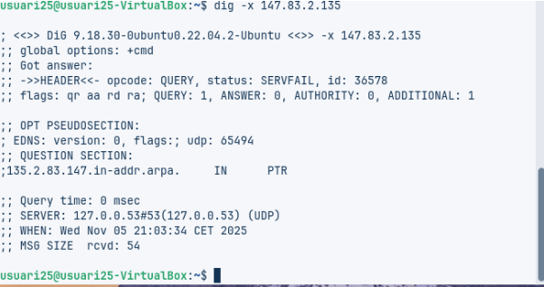
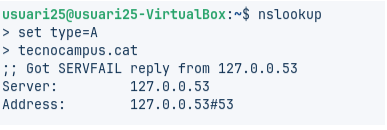
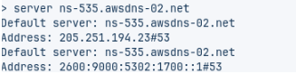
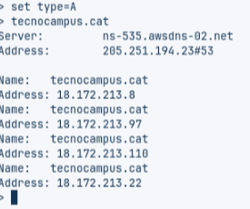

# 🧩 T06: Fonaments del servei DNS
---

```{"variant":"standard","id":"73152","title":"Fase Pràctica: Diagnosi de Noms (Auditoria amb CLI)"}
# 🧰 Fase Pràctica: Diagnosi de Noms (Auditoria amb CLI)

## ℹ️ Sobre aquesta guia
Aquesta guia descriu com dur a terme una **auditoria DNS** emprant les eines més habituals de la línia d’ordres.  

El **DNS (Domain Name System)** actua com una mena d’“agenda de contactes” d’Internet, traduint els **noms de domini** (com ara `google.com`) en **adreces IP** comprensibles pels ordinadors. 🌐💻
```
---

## 🧪 Comanda 1: Consulta Bàsica de Registre A

### 💻 Codi utilitzat

```bash
dig xtec.cat A
```

### 🔍 Anàlisi

La **IP de resposta** és `83.247.151.214`, amb un **valor TTL** de `3270` segons.
El **servidor que va respondre** és `127.0.0.53`, que correspon al **servidor DNS local** del sistema.

El **temps de consulta** va ser de `5 ms`, un resultat molt ràpid.
El **TTL** indica quant de temps es mantindrà aquesta resposta a la **memòria cau** abans de realitzar una nova consulta. ⚡🧠


---

## 🧪 Comanda 2: Consulta de Servidors de Noms (NS)

### 💻 Codi utilitzat

```bash
dig tecnocampus.cat NS
```

### 🔍 Anàlisi

El domini **tecnocampus.cat** disposa de **quatre servidors de noms autoritatius**:

* `ns-1689.awsdns-19.co.uk`
* `ns-535.awsdns-02.net`
* `ns-1071.awsdns-05.org`
* `ns-130.awsdns-16.com`

Aquests servidors pertanyen a **AWS (Amazon Web Services)** i són els **responsables finals de proporcionar informació autoritativa** sobre aquest domini. 🌐🛠️


## 🧪 Comanda 3: Consulta Detallada SOA

### 💻 Codi utilitzat

```bash
dig escolapia.cat SOA
```

### 🔍 Anàlisi

El **correu de l’administrador** és `root.dns1.nominalia.com`, el **número de sèrie** és `1761028965` i el **servidor DNS primari** és `dns1.nominalia.com`.

El registre **SOA (Start of Authority)** actua com el **“document d’identitat”** del domini, ja que conté informació essencial com el responsable de la seva gestió i la data de l’última actualització. 🪪🗓️


---

## 🧪 Comanda 4: Consulta de resolució inversa

### 💻 Codi utilitzat

```bash
dig -x 147.83.2.135
```

### 🔍 Anàlisi

La **IP 147.83.2.135** està associada a diversos **noms de domini de la UPC**, com ara:

* `barcelonatech.upc.edu`
* `upc.edu`
* `www.upc.es`
* `upc.cat`
* entre d’altres.

Això indica que **una mateixa adreça IP pot allotjar o donar servei a múltiples webs i serveis diferents alhora**. 🌍💡



---


# 💻 Comprovació de Resolució amb nslookup (Multiplataforma)

L’eina **nslookup** es troba a pràcticament qualsevol sistema operatiu. ⚙️
Es pot usar de forma similar a **`dig`**, incloent l’argument directament, o bé executar **`nslookup`** sense arguments per entrar en el **mode interactiu**.

💡 En aquest mode, apareix un *prompt* (`>`), des d’on podreu fer diferents consultes DNS de manera seqüencial.
Serà aquest **mode interactiu** el que explorareu en aquesta fase pràctica. 🔍🧩

---

## 🧪 Comanda 1: Consulta Bàsica no Autoritativa

### 💻 Codi utilitzat

```bash
nslookup
```

### 🔍 Anàlisi – Per què és “no autoritativa”?

La resposta és **no autoritativa** perquè prové del **servidor DNS local** (`127.0.0.53`), que ha emmagatzemat la informació a la **memòria cau**.

No s’ha consultat directament els **servidors autoritatius de `tecnocampus.cat`**.
És com **obtenir una resposta d’algú que ja la coneixia prèviament**, en lloc de demanar-la directament a la **font original**. 🧠💡



---

## 🧪 Comanda 2: Consultes autoritatives

### 💻 Codi utilitzat

```bash
nslookup
```

### 🔍 Anàlisi – Diferències amb la comanda 1

En aquest cas, la consulta s’ha fet **directament al servidor** `ns-535.awsdns-02.net`, que és un **servidor autoritatiu**.

La **resposta és autoritativa** perquè prové directament de la **font original**.
La informació obtinguda és la mateixa que a la comanda anterior, però **molt més fiable**, ja que **no passa per cap servidor intermediari ni memòria cau**. 🧩✅

     

  ---

  ## 🧾 Conclusió

Aquesta pràctica ha servit per **entendre com funciona el servei DNS** i com utilitzar eines com **`dig`** i **`nslookup`** per **analitzar dominis**. 🌐🔍

També s’ha vist la **diferència entre respostes autoritatives i no autoritatives**, així com la **utilitat de la resolució local** en xarxes internes, millorant la comprensió del funcionament real de la infraestructura de noms d’Internet. 💡💻

---

                                                                                                                    **Fet per Blai Vergés** 

